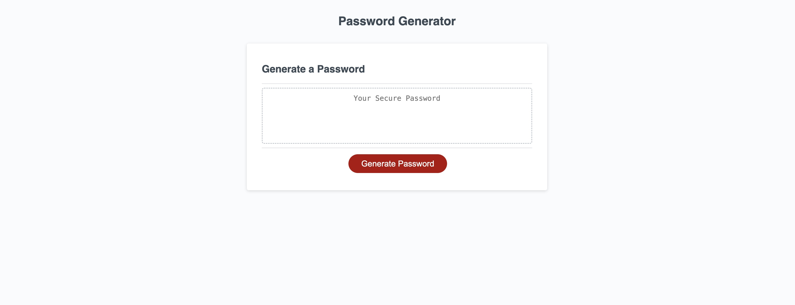

# Password Generator

## Description

The Password Generator is a simple web application that allows users to generate strong and secure passwords by selecting specific criteria.

## Table of Contents

- [Features](#features)
- [Installation](#installation)
- [Screenshot](#screenshot)
- [Contributing](#contributing)
- [License](#license)

## Features

- Generate passwords with customizable length.
- Select character types to include (lowercase, uppercase, numeric, and special characters).
- Responsive design for various screen sizes.
- Easy-to-use interface.

## Installation

1. Clone the repository:

   ```bash
   git clone https://github.com/cpulsipher/password-generator.git

## Screenshot


## License
Please refer to the LICENSE file in the repository. 
